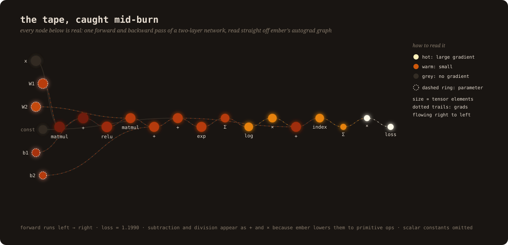
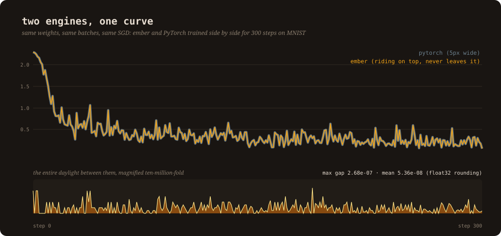
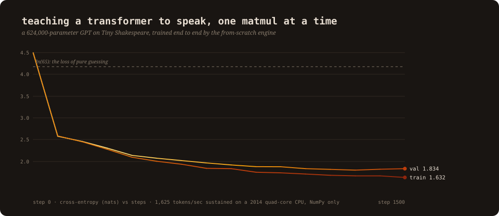
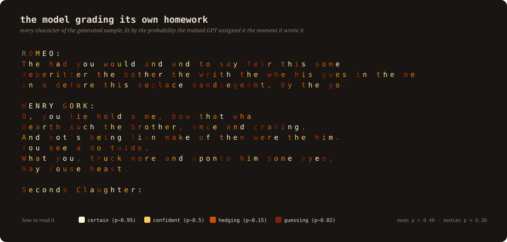
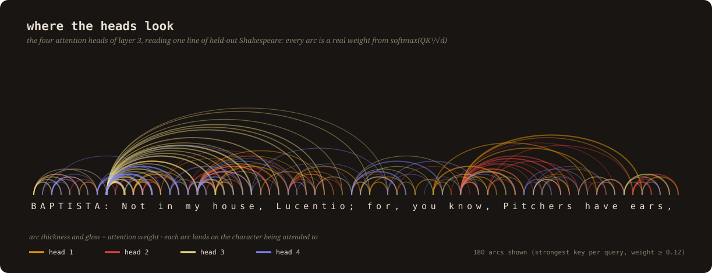

# ember

A tensor autograd engine I wrote from scratch on top of raw NumPy, then proved
correct the hard way: every operation is gradient-checked against PyTorch, and
when I train the same network with the same weights and the same batches in
both engines, the two loss curves match to within 2.7e-07 over 300 steps of
momentum SGD. That is float32 rounding noise. Then I used it to train a real
GPT, end to end, with PyTorch nowhere in the loop.



## The math, animated

Before the code, the idea. This is what `backward()` actually is, animated
with Manim over the same graph as above: local derivatives, multiplied along
the tape in reverse, summed where paths meet.


(Source: [assets/manim_chain_rule.py](assets/manim_chain_rule.py), full video
in [assets/chain_rule.mp4](assets/chain_rule.mp4). One deliberate detail: the
`x` node never ignites, because inputs have `requires_grad=False` and the
engine really does stop the burn there.)

## Why I built this

Frameworks make backpropagation invisible, and invisible is exactly how you
end up with a whole generation of people (me included, until recently) who can
train models but cannot say what `loss.backward()` actually does. Micrograd
exists, but it is scalar-valued, and the moment you go from scalars to tensors
the actual hard problems show up: broadcasting, gradient accumulation across
views, batched matmul, numerical stability. Those problems are the point.
So the rule for this project was simple: NumPy arrays and arithmetic only,
everything above that level is mine, and every claim gets verified against
PyTorch rather than eyeballed.

What lives in the roughly 700 lines of the package:

- `ember/tensor.py`: the engine. A `Tensor` holding a NumPy array, a gradient,
  and a closure that knows how to push gradients to its parents. Ops: full
  broadcasting arithmetic, batched `@`, `exp/log/tanh/relu/sigmoid`, reductions
  (`sum/mean/max`), `reshape/transpose/slicing`, advanced integer indexing.
  `backward()` does an iterative topological sort with an explicit stack, and
  then runs the tape in reverse.
- `ember/nn.py`: Linear, Embedding, LayerNorm, Dropout, causal multi-head
  attention, a pre-norm transformer block, and a small GPT, all composed from
  the primitives so their gradients are correct by construction.
- `ember/functional.py`: softmax, log-softmax, cross-entropy, GELU, written
  with the standard numerical-stability tricks (subtract the detached max
  before exponentiating, log-sum-exp for the loss).
- `ember/optim.py`: SGD with momentum, AdamW (decoupled decay, bias
  correction), global-norm gradient clipping, cosine schedule with warmup.

## The receipts

I did not want "it seems to work." I wanted equivalence, so there are three
layers of proof, in increasing order of brutality.

**1. Per-op gradient checks against PyTorch.** Every primitive and every
composite (softmax, cross-entropy, GELU, LayerNorm, full causal attention with
shared weights) is run in both engines in float64 and compared, forward values
and gradients, at 1e-9 absolute tolerance. The suite is
[tests/test_grads.py](tests/test_grads.py); it also finite-difference checks
87 randomly chosen parameters of a complete GPT against the analytic gradients
the engine produces.

**2. The parity experiment.** Same MLP, weights copied bit for bit into
PyTorch, same batch order, same SGD with momentum, 300 steps on MNIST, both
engines running side by side:



Max gap between the curves over all 300 steps: **2.68e-07**. Mean: 5.36e-08.
Reproduce it with `python examples/parity_pytorch.py`.

**3. It trains real models.** Not toy fits, actual training runs with held-out
evaluation, on a 2014 quad-core Intel laptop, in NumPy.

| run | result | wall clock |
|---|---|---|
| MNIST MLP (784-256-128-10, AdamW) | **97.83%** test accuracy | 19 s, 5 epochs |
| char-GPT on Tiny Shakespeare (624K params, 3 layers, 4 heads) | val loss **1.83** (4.49 at init, ln 65 is pure guessing) | 35 min, 1,625 tok/s |



The GPT run uses the full modern recipe, all of it implemented here: AdamW,
linear warmup into cosine decay, global-norm clipping at 1.0, dropout,
pre-norm blocks. A sample from the trained model is in
[assets/shakespeare_sample.txt](assets/shakespeare_sample.txt).

## Watching the trained model think

Because the engine is mine all the way down, introspection is free, so I put
the trained GPT back under the microscope. First: the sample it generated,
where each character is lit by the probability the model assigned it at the
moment of writing. The text is the chart.



You can watch it commit: the first letter of a name is a dim guess, the rest
of the name burns bright (once you have "R", "OMEO:" is nearly free). Function
words glow; the made-up words it half-remembers fade back to ash. Mean
probability over the sample is 0.40, median 0.30, measured, not vibes.

Second: the four attention heads of the last layer reading a line of held-out
Shakespeare, every arc a real weight out of softmax(QK^T / sqrt(d)):



The pale head keeps reaching back to the speaker tag at the start of the line,
behaving like an anchor head; the others work short-range structure. This is a
624K-parameter model trained for 35 minutes on a laptop, and it already grew a
division of labor. (The capture hook is two lines in
[ember/nn.py](ember/nn.py): set `store_att = True` on any attention module.)

## The three bugs that taught me the most

**Broadcasting is the real boss fight.** When `(4, 5) + (5,)` runs forward,
NumPy silently copies the second tensor across rows. Backward, those copies
each carry gradient, and they all belong to the same five numbers. Get the
un-broadcast reduction wrong (which axes to sum, when to keep dims) and
nothing crashes; your model just trains slightly wrong forever. My
`_unbroadcast` is 10 lines and I trust it because the test suite hammers it
through every broadcast pattern the transformer uses, in float64, against
what PyTorch produces.

**Repeated indices must accumulate.** An embedding layer looks up the same
token twice in one batch, so its backward pass has to add gradients into the
same row twice. `buf[idx] += g` silently drops the second write (NumPy fancy
indexing keeps only the last one); `np.add.at(buf, idx, g)` is the correct,
much slower cousin. The test for this uses a deliberately repeated index and
fails loudly on the naive version.

**Graph traversal has sharp edges I only found by measuring.** I wrote the
topological sort with an explicit stack instead of the textbook recursion, then
went back and measured whether that actually mattered. Answer: the 3-layer
GPT's graph has a longest path of 201 nodes, growing by about 60 per layer, so
worst-case recursive traversal crosses Python's default 1,000-frame limit
somewhere past 16 layers. The sharper surprise was the first time I walked the
graph without memoization to measure its depth: residual connections mean the
number of paths through the graph is exponential in depth, and the script that
"just counts" hung for minutes on a model that trains in seconds. A DAG is not
a tree, and every traversal in the engine has to know that.

## Running it

```bash
pip install numpy            # the only runtime dependency
sh data/get_data.sh          # MNIST + Tiny Shakespeare

python examples/train_mnist.py        # ~20 s
python examples/train_shakespeare.py  # ~40 min on an old quad-core

pip install torch            # only needed to verify me against PyTorch
python tests/test_grads.py
python examples/parity_pytorch.py
```

Note for Intel-Mac users: the last PyTorch with x86 macOS wheels (2.2.2) was
built against NumPy 1.x, so the verification scripts need `numpy<2` in the
environment. The engine itself runs on either.

## What the tape costs

I benchmarked the engine against PyTorch on the exact shapes the transformer
uses, forward plus backward ([benchmarks/ops_bench.py](benchmarks/ops_bench.py)):

| op (attention-sized shapes) | ember | PyTorch | ratio |
|---|---|---|---|
| batched matmul (24,4,96,32) @ (24,4,32,96) | 11.9 ms | 7.1 ms | 1.7x |
| softmax (24,4,96,96) | 15.8 ms | 2.8 ms | 5.7x |
| layernorm chain (24,96,128) | 6.9 ms | 3.5 ms | 2.0x |

The matmul gap is small because both engines bottom out in the same BLAS. The
softmax gap is the real lesson: PyTorch runs one fused kernel where my tape
records five separate ops (max, subtract, exp, sum, divide), each allocating
its own array and its own backward closure. That 5.7x is the measured price of
composability without fusion, and closing gaps like it is what the later
projects in this series are about.

## What this is not

No GPU, no kernels, no graph compilation, and `np.add.at` makes embedding
backward slower than it deserves to be. Those are not oversights, they are the
next projects: this engine is the foundation of a longer from-scratch ML
systems series, and the training throughput numbers here are the baseline the
later work gets measured against.

The visuals are hand-built SVG, generated from live engine state and real
training logs by [assets/make_visuals.py](assets/make_visuals.py). The graph
at the top is not a diagram of how autograd works in general; it is this
engine's actual tape from an actual backward pass, with node color encoding
the measured gradient magnitudes.
